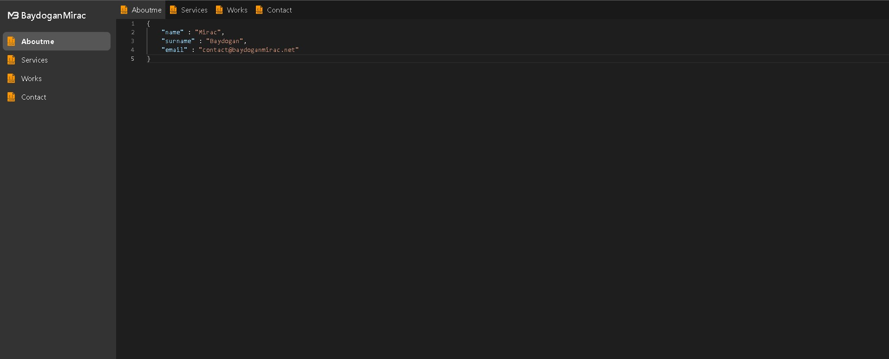

# My Portfolio

Welcome to my personal portfolio website! This project is built using NEXT.js, a React-based framework, and it serves as a showcase of my skills, projects, and experiences.

## Features

- Modern and responsive design
- Interactive user interface
- Code editor-inspired layout
- Display of projects with descriptions and links
- About Me section highlighting my skills and background
- Contact form for getting in touch

## Live Demo

Check out the live demo of the portfolio website [here](https://baydoganmirac.net) or [vercel](https://my-portfolio-smoky-kappa.vercel.app/).

## Technologies Used

- NEXT.js: A React framework for building server-side rendered and statically generated web applications.
- React: A JavaScript library for building user interfaces.
- Tailwind CSS: A utility-first CSS framework for styling the user interface.

## Getting Started

To run this project locally, follow these steps:

1. Clone the repository: `git clone https://github.com/BaydoganMirac/my-portfolio.git`
2. Install the dependencies: `npm install`
3. Run the development server: `npm run dev`
4. Open your browser and visit: `http://localhost:3000`

## Customization

You can customize this portfolio website to make it your own:

- Update the works in the `./content/Works.json` file with your own projects. You must be add `Works.json` file in content folder.
- Modify the content in the `./content/Aboutme.json` file to reflect your skills and background.
- Customize the styles using Tailwind CSS utility classes in the components.
- Add your own sections and components to extend the functionality of the website.

Feel free to make it unique and tailor it to your personal branding!

## Deployment

This project can be easily deployed to various hosting platforms. You can choose the one that best fits your needs, such as Vercel, Netlify, or AWS Amplify. Refer to the documentation of your preferred platform for detailed deployment instructions.

## Contributing

Contributions are welcome! If you find any issues or have suggestions for improvements, please open an issue or submit a pull request. Let's make this portfolio website even better together!

## License

This project is licensed under the Apache License 2.0. See the [LICENSE](LICENSE) file for details.

---

Thank you for checking out my portfolio website! If you have any questions or need further assistance, feel free to reach out.
